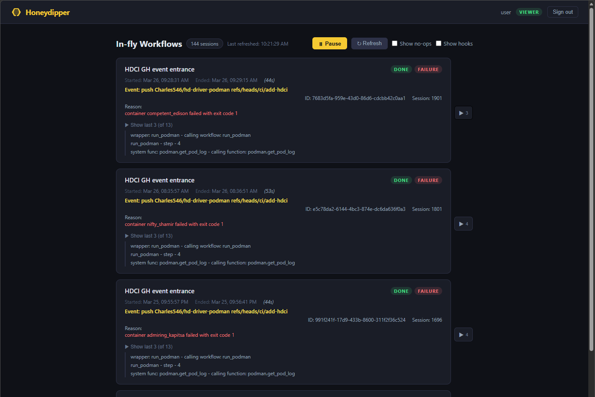

# Honeydipper Web UI

A React/Vite single-page app that shows in-fly Honeydipper workflow sessions in real time.

## Features

- **Live workflow view** — polls `GET /api/events` every 5 seconds, shows session state, status, and performing steps
- **Flexible authentication** — Bearer token or HTTP Basic Auth (matches `auth-simple` driver schemes)
- **Role-based UI** — derives role from the authenticated subject; hides actions the user cannot perform
- **Pagination** — cursor-based paging through sessions
- **Auto-refresh toggle** — pause/resume live polling

## Screenshot



## Quick start

```bash
cd hd-ui
npm install
HD_API_URL=http://your-honeydipper:9000 npm run dev
```

The Vite dev server proxies `/api` and `/healthz` to `HD_API_URL` (default `http://localhost:9000`).

## Testing

```bash
npm test
```

For watch mode:

```bash
npm run test:watch
```

## Release checklist

Before tagging or publishing a release:

- Run `npm test`
- Run `npm run build`
- Confirm API connectivity assumptions for target environment (same-origin proxy or split-origin with CORS)
- Verify `LICENSE` and `LICENSE-COMMERCIAL.md` are present and unchanged
- Update release notes/changelog summary for user-visible changes
- Capture UI screenshots for notable UI/UX changes

## Versioning

This project follows Semantic Versioning (`MAJOR.MINOR.PATCH`).

- `MAJOR`: breaking changes
- `MINOR`: backward-compatible features
- `PATCH`: backward-compatible fixes

Recommended Git tag format: `vX.Y.Z` (for example, `v0.2.1`).

## Production build

```bash
npm run build
# Serve dist/ with any static file server, proxying /api to Honeydipper
```

The web UI bundle itself can be hosted as static assets on a CDN. It still requires a reachable Honeydipper API endpoint for `/api` and `/healthz`.

## Deployment patterns

### 1) Same-origin proxy (recommended)

- Host the built UI from a web server/CDN
- Route `/api/*` and `/healthz` to the Honeydipper API service
- Keeps auth and CORS simpler because the browser sees one origin

### 2) Split-origin (UI CDN + separate API domain)

- UI can run fully static from CDN
- API runs on a different host/domain
- Ensure CORS is configured correctly on the API side

## Authentication

The UI supports the same schemes as the `auth-simple` driver:

| Scheme | How to use |
|--------|-----------|
| Bearer token | Paste a token from `daemon.services.api` config |
| Basic auth | Username + password from `data.users` in `auth-simple` driver config |

Credentials are stored in `sessionStorage` and cleared on sign-out.

## Role-based authorization

Roles are derived from the `subject` string returned by the auth driver:

| Subject prefix | Role | Permissions |
|---------------|------|-------------|
| `admin*` | admin | events:read, events:write |
| `operator*` | operator | events:read, events:write |
| anything else | viewer | events:read |
| `guest` / unauthenticated | guest | none |

Adjust `ROLE_PERMISSIONS` and `deriveRole` in `src/auth/AuthContext.jsx` to match your Casbin policies.

## Adding container log viewer (future)

The `src/api.js` file is the single place to add new API calls. When a log-streaming endpoint is available (e.g. from a Kubernetes or Podman driver), add a function there:

```js
// Example — add when the log API is ready
export async function streamContainerLogs(creds, containerID, signal) {
  const res = await fetch(`/api/logs/${encodeURIComponent(containerID)}`, {
    headers: getAuthHeader(creds),
    signal,
  })
  return res.body // ReadableStream for incremental display
}
```

Then create `src/components/LogViewer.jsx` and add it as a tab or drawer on `SessionCard`.

## Project structure

```
hd-ui/
├── src/
│   ├── api.js                  # All HD API calls
│   ├── auth/
│   │   ├── AuthContext.jsx     # Credentials, role, permissions
│   │   └── LoginForm.jsx       # Token / Basic auth login
│   ├── components/
│   │   ├── NavBar.jsx          # Top bar with user/role/logout
│   │   ├── WorkflowList.jsx    # Polling list of sessions
│   │   └── SessionCard.jsx     # Single session display
│   ├── App.jsx
│   └── main.jsx
├── index.html
├── vite.config.js
└── package.json
```

## Contributing

See `CONTRIBUTING.md` for development expectations and contribution rules.

Issue templates are available under `.github/ISSUE_TEMPLATE/`.

## Commercial licensing

If your intended use does not fit AGPL obligations, see `LICENSE-COMMERCIAL.md` and contact the copyright holder for commercial terms.

## Policy links for GitHub App listing

- Privacy Policy: [PRIVACY.md](PRIVACY.md)
- Terms of Service: [TERMS-OF-SERVICE.md](TERMS-OF-SERVICE.md)

Public URLs (for GitHub App configuration):

- Privacy Policy URL: https://github.com/Charles546/hd-ui/blob/main/PRIVACY.md
- Terms of Service URL: https://github.com/Charles546/hd-ui/blob/main/TERMS-OF-SERVICE.md

## License

This project is prepared for dual licensing:

- `LICENSE` — GNU Affero General Public License v3.0
- `LICENSE-COMMERCIAL.md` — commercial licensing path for organizations that want to use the software outside the AGPL terms

The AGPL license applies by default unless you have a separate written commercial agreement with the copyright holder.
